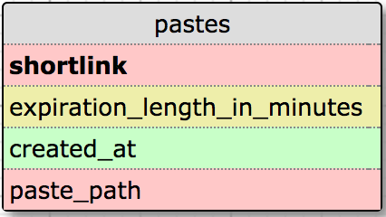

## Setup
### 1. Install virtualenv and virtualenvwrapper via pip (if you don't have):
```sh
$ pip install virtualenv
$ pip install virtualenvwrapper
```
### 2. Configure virtualenv
```sh
$ export WORKON_HOME=~/Envs
$ source /usr/local/bin/virtualenvwrapper.sh
```
### 3. Make virtualenv and activate it
```sh
$ mkvirtualenv pastebin-venv
$ workon pastebin-venv
```
### 4. Install requirements
```sh
$ pip install -r requirements.txt
```

## Run

```sh
$ export FLASK_APP=run.py
$ export FLASK_DEBUG=1
$ flask run
```
### Or

```sh
$ python run.py
```

## Stop
```
ctrl+c
$ deactivate
```

## Data Model


## Database Migration
```sh
$ python manage.py db init
$ python manage.py db migrate
$ python manage.py db upgrade
```
